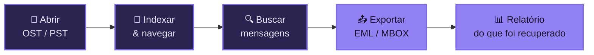

<div align="center">


<br/>

**Recupere e exporte e-mails de arquivos `OST` e `PST` — mesmo quando o Outlook não abre mais.**
Um aplicativo de desktop simples e um CLI poderoso. Tudo roda **na sua máquina**.

<br/>

[](https://github.com/borges-br/mailvault_recovery/releases)
[](https://dotnet.microsoft.com/)
[](#-começando)
[](#-privacidade-em-primeiro-lugar)

[**⬇️ Baixar**](https://github.com/borges-br/mailvault_recovery/releases) · [**📖 Documentação**](docs/README.md) · [**🚀 Começando**](#-começando) · [**🗺️ Roadmap**](docs/ROADMAP.md)

</div>

---

## 💔 O problema

Aquele arquivo `.ost` de 12 GB de uma conta que não existe mais. O `.pst` de backup que o Outlook se recusa a importar. A caixa de e-mails de um colaborador que saiu, presa num arquivo que nenhum cliente de e-mail consegue abrir.

E-mails importantes ficam **reféns de um formato proprietário** — até serem perdidos de vez.

## 💜 A solução

**MailVault Recovery** abre esses arquivos, lê pasta por pasta, mensagem por mensagem, e devolve tudo em **formatos abertos** (`EML` e `MBOX`) que qualquer cliente de e-mail moderno entende — Thunderbird, Outlook, Apple Mail e outros.

E o mais importante: quando encontra uma mensagem ou anexo problemático, ele **não desiste** — registra o problema, segue em frente e te entrega um relatório do que recuperou.

<div align="center">



</div>

---

## ✨ Por que MailVault?

| | Recurso | O que isso significa pra você |
| :---: | :--- | :--- |
| 🛟 | **Recuperação resiliente** | Uma mensagem corrompida ou um anexo ilegível **não derruba** o processo. Recupera o máximo possível e relata o resto. |
| 📨 | **Formatos abertos** | Exporta para `EML` (um arquivo por mensagem) e `MBOX` (caixa por pasta) — sem ficar preso a software proprietário. |
| ⚡ | **Recuperação em 1 comando** | `recover-eml arquivo.ost --out pasta` e pronto: nada de configurar caso, banco ou índice antes. |
| 🔍 | **Busca local** | Indexa metadados em SQLite e permite buscar por remetente, assunto, data e texto — sem subir nada pra nuvem. |
| 🖥️ | **Desktop + CLI** | App visual para o dia a dia; linha de comando para automação, scripts e lotes grandes. |
| 🔒 | **100% offline** | Seus e-mails **nunca saem da máquina**. Sem telemetria, sem upload, sem conta. |
| 🌗 | **Temas claro e escuro** | Interface Avalonia moderna, com tema Dark/Light. |
| 📊 | **Relatórios claros** | Cada exportação gera relatório (`JSON` / `CSV` / `Markdown`) com totais, falhas e tempo. |

---

## 📂 Formatos suportados

<table>
<tr><th>Entrada (ler / recuperar)</th><th>Saída (exportar)</th></tr>
<tr>
<td>

| Formato | Status |
| :--- | :--- |
| `.ost` — Outlook Offline Store | ✅ Suportado |
| `.pst` — Outlook Personal Store | ✅ Suportado |

</td>
<td>

| Formato | Status |
| :--- | :--- |
| `.eml` — RFC 822 (1 msg/arquivo) | ✅ Suportado |
| `.mbox` — mboxrd (1 caixa/pasta) | ✅ Suportado |

</td>
</tr>
</table>

> [!NOTE]
> A leitura de `OST/PST` usa o motor [XstReader](docs/EXTERNAL_TOOLS.md). Suporte experimental a `libpff/pffexport` existe como diagnóstico/fallback. Veja [limitações e roadmap](docs/ROADMAP.md).

---

## 🚀 Começando

### Opção 1 — Aplicativo Desktop (recomendado)

1. **[Baixe o último release](https://github.com/borges-br/mailvault_recovery/releases)** (build self-contained para Windows x64 — não precisa instalar o .NET).
2. Extraia o `.zip` e execute **`MailVault.Desktop.exe`**.
3. O assistente guia você: abrir o arquivo → indexar → navegar/buscar → exportar.

### Opção 2 — Linha de comando (CLI)

```powershell
# Recuperação direta OST/PST → EML, sem indexar nada antes
mailvault recover-eml "C:\backup\caixa.ost" --out "C:\recuperados"

# Ou para MBOX (uma caixa por pasta)
mailvault recover-mbox "C:\backup\caixa.pst" --out "C:\recuperados"
```

> 💡 Precisa de busca, índice persistente e validação? Use o fluxo `index → search → export → validate`. Tudo em **[📖 Manual do CLI](docs/cli-commands.md)**.

---

## 🔒 Privacidade em primeiro lugar

> [!IMPORTANT]
> **Nada sai do seu computador.** O MailVault Recovery não tem servidor, não faz upload e não coleta telemetria. Seus e-mails — muitas vezes os dados mais sensíveis de uma pessoa ou empresa — são processados inteiramente offline, em arquivos locais que você controla.

Boas práticas para recuperar com segurança (sempre trabalhe sobre uma **cópia** do arquivo original) estão em **[Segurança e integridade de dados](docs/data-safety.md)**.

---

## 📖 Documentação

A documentação completa vive em **[`docs/`](docs/README.md)**. Atalhos:

| Guia | Conteúdo |
| :--- | :--- |
| 🧭 [Visão geral da documentação](docs/README.md) | Índice e ponto de entrada. |
| 🏗️ [Arquitetura](docs/ARCHITECTURE.md) | Como o produto é construído por dentro. |
| 💻 [Manual do CLI](docs/cli-commands.md) | Todos os comandos, opções e exemplos. |
| 🛠️ [Build e publicação](docs/BUILD_AND_PUBLISH.md) | Compilar, testar e gerar o release Windows. |
| 🔌 [Ferramentas externas](docs/EXTERNAL_TOOLS.md) | XstReader, libpff/pffexport e readpst. |
| 🩺 [Solução de problemas](docs/TROUBLESHOOTING.md) | Diagnóstico dos erros mais comuns. |
| 🛡️ [Segurança de dados](docs/data-safety.md) | Trabalhar com cópias, hash e privacidade. |
| 🗺️ [Roadmap](docs/ROADMAP.md) | O que existe, o que é parcial e o que vem por aí. |

---

## 🧩 Em resumo

<div align="center">

**MailVault Recovery** transforma arquivos de e-mail presos e ilegíveis em mensagens abertas, pesquisáveis e portáveis — com um app simples, um CLI poderoso e **zero dados saindo da sua máquina**.

</div>

---

<div align="center">

<sub>© 2026 MailVault Recovery · Nathan Borges. Todos os direitos reservados.</sub><br/>
<sub>Construído com .NET 10 · Avalonia · MimeKit · SQLite · XstReader.</sub>

</div>
