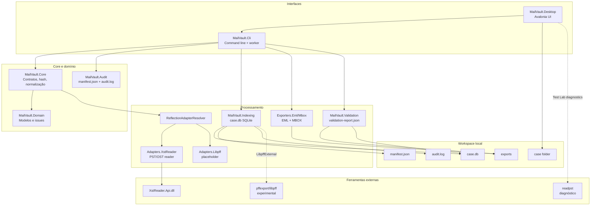
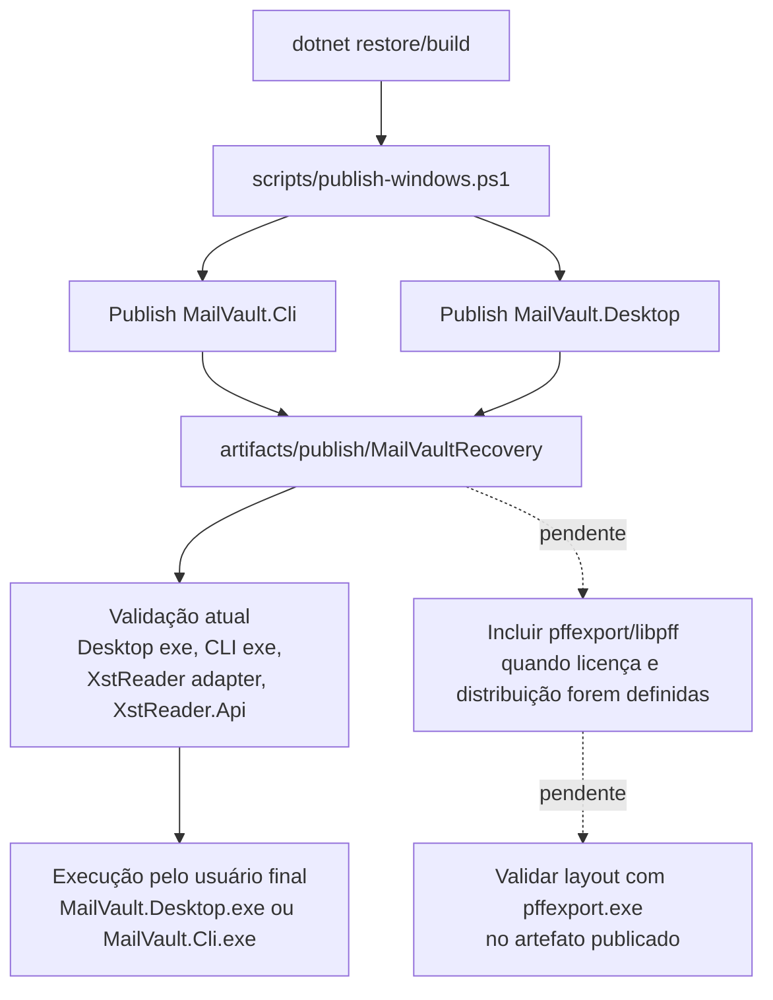

# MailVault Recovery


[](https://dotnet.microsoft.com/)
[](https://avaloniaui.net/)
[](https://www.sqlite.org/)


**MailVault Recovery** é uma ferramenta local para recuperação técnica, indexação, consulta, exportação e validação de e-mails a partir de evidências de correio eletrônico. O estado atual do código concentra o suporte de leitura em arquivos **PST/OST** via `XstReader.Api`, com exportação para **EML** e **MBOX**, validação de artefatos exportados, trilha de auditoria e interface Desktop em Avalonia.

> [!IMPORTANT]
> Esta documentação descreve o comportamento comprovado no código deste repositório. Funcionalidades como empacotamento automático de `pffexport/libpff` e ingestão direta de `MBOX`, `EML` ou `MSG` ainda não aparecem como implementação completa no código atual e estão documentadas como limitações ou roadmap.

## Índice

- [What is MailVault Recovery?](#what-is-mailvault-recovery)
- [Principais recursos](#principais-recursos)
- [Casos de uso](#casos-de-uso)
- [Estado atual do projeto](#estado-atual-do-projeto)
- [Arquitetura do projeto](#arquitetura-do-projeto)
- [Fluxos técnicos](#fluxos-técnicos)
- [Estrutura de diretórios](#estrutura-de-diretórios)
- [Pré-requisitos](#pré-requisitos)
- [Executar em desenvolvimento](#executar-em-desenvolvimento)
- [Compilar, testar e publicar](#compilar-testar-e-publicar)
- [Dependências externas e pffexport](#dependências-externas-e-pffexport)
- [Comandos CLI](#comandos-cli)
- [Logs e caminhos relevantes](#logs-e-caminhos-relevantes)
- [Troubleshooting rápido](#troubleshooting-rápido)
- [Estratégia de testes](#estratégia-de-testes)
- [Segurança e integridade de dados](#segurança-e-integridade-de-dados)
- [Documentação complementar](#documentação-complementar)
- [Licença e créditos](#licença-e-créditos)

## What is MailVault Recovery?

MailVault Recovery organiza um fluxo de recuperação técnica em torno de um **case folder** local. A aplicação calcula hash SHA-256 da evidência, cria `manifest.json` e `audit.log`, indexa metadados em `case.db`, permite busca e navegação por pastas/mensagens e exporta resultados para formatos abertos.

O projeto tem duas entradas operacionais:

| Interface | Implementação | Papel |
| --- | --- | --- |
| Desktop | `src/MailVault.Desktop` | Aplicação Avalonia para criar/abrir casos, acompanhar jobs, navegar, buscar, exportar, validar e operar o Test Lab. |
| CLI | `src/MailVault.Cli` | Automação técnica via comandos `inspect`, `tree`, `list`, `preview`, `index`, `stats`, `search`, `export`, `validate`, `corpus scan` e workers internos. |

## Principais recursos

| Recurso | Status | Evidência no código |
| --- | --- | --- |
| **Leitura PST/OST via XstReader** | Implementado | `MailVault.Adapters.XstReader`, resolução dinâmica por `ReflectionAdapterResolver`. |
| **Indexação SQLite** | Implementado | `MailVault.Indexing`, schema `case.db` versão 3, tabelas de caso, runs, pastas, mensagens, anexos e issues. |
| **Desktop Avalonia** | Implementado | Wizard de novo caso, abertura de workspace, overview, browser, busca, exportação, validação, settings e Test Lab. |
| **CLI operacional** | Implementado | Comandos de inspeção, indexação, estatísticas, busca, exportação, validação e corpus. |
| **Exportação EML/MBOX** | Implementado | `MailVault.Exporters.Eml`, `MailVault.Exporters.Mbox` e `ExportJobRunner`. |
| **Validação de exportação** | Implementado | `MailVault.Validation`, relatórios JSON, checks de EML, MBOX, anexos e manifest. |
| **Auditoria e manifesto** | Implementado | `MailVault.Audit`, `audit.log`, `manifest.json`, eventos e hash da evidência. |
| **Worker CLI para Desktop** | Implementado | `WorkerProcessOrchestrator`, `WorkerExecutableResolver` e comando interno `worker`. |
| **Diagnóstico pffexport/libpff** | Parcial | Detector e motor experimental `LibpffExternal`; sem parsing completo para `case.db`. |
| **Plug and play com pffexport empacotado** | Pendente | Script de publish não inclui nem valida `pffexport.exe`. |
| **Ingestão direta MBOX/EML/MSG** | Pendente/parcial | MBOX/EML aparecem em exportação, validação e corpus scan; não há reader de ingestão completa. |

## Casos de uso

- Criar um caso técnico a partir de `.pst` ou `.ost` preservando hash, manifesto e trilha de auditoria.
- Indexar pastas, mensagens e anexos em SQLite para navegação e consulta local.
- Buscar mensagens por texto, remetente, destinatário, assunto e metadados indexados.
- Exportar subconjuntos de mensagens para EML ou MBOX, com opção de anexos.
- Validar se uma exportação gerada está consistente com o índice e com o manifest.
- Executar pipelines de validação local sobre corpus controlado de evidências.
- Diagnosticar disponibilidade de ferramentas externas como `pffexport` e `readpst`.

## Estado atual do projeto

| Área | Estado | Observações |
| --- | --- | --- |
| PST/OST com XstReader | Pronto para uso técnico | Depende de `MailVault.Adapters.XstReader.dll` e `XstReader.Api.dll` estarem no output. O publish atual valida esses arquivos. |
| Libpff/pffexport | Experimental | Pode executar `pffexport`, criar `libpff-recovery` e registrar diagnóstico, mas não converte a saída em mensagens indexadas. |
| Adapter `MailVault.Adapters.Libpff` | Placeholder | O assembly é copiado, mas não contém implementação de `IMailStoreReader`. |
| Desktop plug and play | Parcial | O artefato publicado inclui Desktop, CLI, XstReader e dependências .NET conforme publish; não inclui binários externos do libpff. |
| Exportação | Implementada | EML e MBOX a partir de casos indexados, com manifest de exportação. |
| Validação | Implementada | Relatório JSON e checks de estrutura/contagem/manifest. |
| Segurança operacional | Parcial | Há hash, manifest, audit log e mascaramento em relatórios; cadeia de custódia formal continua responsabilidade do operador. |

## Arquitetura do projeto



Leia mais em [docs/ARCHITECTURE.md](docs/ARCHITECTURE.md).

## Fluxos técnicos

### Recuperação, indexação e exportação


### Publicação plug and play



> [!NOTE]
> O fluxo plug and play está implementado para a composição Desktop + CLI + XstReader validada pelo script de publish. O empacotamento de `pffexport/libpff` ainda é uma melhoria técnica recomendada.

## Estrutura de diretórios

```text
.
├── MailVault.sln
├── README.md
├── scripts/
│   ├── publish-windows.ps1
│   └── validation/
├── src/
│   ├── MailVault.Domain/
│   ├── MailVault.Core/
│   ├── MailVault.Audit/
│   ├── MailVault.Indexing/
│   ├── MailVault.Exporters.Eml/
│   ├── MailVault.Exporters.Mbox/
│   ├── MailVault.Validation/
│   ├── MailVault.Adapters.XstReader/
│   ├── MailVault.Adapters.Libpff/
│   ├── MailVault.Cli/
│   └── MailVault.Desktop/
├── tests/
├── docs/
├── artifacts/publish/MailVaultRecovery/
├── mailvault-cases/
├── exports/
└── .local-corpus/
```

`mailvault-cases/`, `exports/`, `.local-corpus/`, `.local_corpus/`, `.tmp/`, `scratch/`, bancos `.db` e mídias de e-mail sensíveis são ignorados pelo `.gitignore`.

## Pré-requisitos

| Requisito | Necessário para | Observação |
| --- | --- | --- |
| .NET SDK compatível com `net10.0` | Build, testes, CLI e Desktop em desenvolvimento | Todos os projetos principais miram `net10.0`. |
| Windows `win-x64` | Script oficial de publish atual | `scripts/publish-windows.ps1` publica para `win-x64` por padrão. |
| `pffexport` no `PATH` ou diretórios conhecidos | Apenas fluxo `LibpffExternal` experimental | Não é necessário para o fluxo padrão com XstReader. |
| Permissão de leitura na evidência | Hash, inspeção, indexação e exportação | Trabalhe sempre sobre cópia da evidência. |
| Permissão de escrita no workspace | `case.db`, logs, manifests e exportações | Evite pastas sincronizadas ou com bloqueio agressivo. |

## Executar em desenvolvimento

Restaure e compile a solução:

```powershell
dotnet restore MailVault.sln
dotnet build MailVault.sln
```

Abrir o Desktop:

```powershell
dotnet run --project src/MailVault.Desktop/MailVault.Desktop.csproj
```

Ver ajuda do CLI:

```powershell
dotnet run --project src/MailVault.Cli/MailVault.Cli.csproj -- --help
```

Criar um caso indexado via CLI:

```powershell
dotnet run --project src/MailVault.Cli/MailVault.Cli.csproj -- index "C:\evidencias\mailbox.ost" --out ".\mailvault-cases" --case-id "CASE-001"
```

Consultar estatísticas:

```powershell
dotnet run --project src/MailVault.Cli/MailVault.Cli.csproj -- stats ".\mailvault-cases\CASE-001"
```

Exportar e validar:

```powershell
dotnet run --project src/MailVault.Cli/MailVault.Cli.csproj -- export ".\mailvault-cases\CASE-001" --format eml --out ".\exports\CASE-001-eml"
dotnet run --project src/MailVault.Cli/MailVault.Cli.csproj -- validate ".\mailvault-cases\CASE-001" --export-folder ".\exports\CASE-001-eml" --format eml --json --out ".\exports\CASE-001-validation"
```

## Compilar, testar e publicar

| Objetivo | Comando real |
| --- | --- |
| Restaurar pacotes | `dotnet restore MailVault.sln` |
| Compilar solução | `dotnet build MailVault.sln` |
| Rodar testes | `dotnet test MailVault.sln` |
| Ajuda do CLI em dev | `dotnet run --project src/MailVault.Cli/MailVault.Cli.csproj -- --help` |
| Desktop em dev | `dotnet run --project src/MailVault.Desktop/MailVault.Desktop.csproj` |
| Publicar Windows framework-dependent | `.\scripts\publish-windows.ps1` |
| Publicar Windows self-contained | `.\scripts\publish-windows.ps1 -SelfContained` |

O publish gera a pasta:

```text
artifacts/publish/MailVaultRecovery/
├── MailVault.Desktop.exe
├── MailVault.Cli.exe
├── MailVault.Adapters.XstReader.dll
├── MailVault.Adapters.Libpff.dll
├── XstReader.Api.dll
└── demais dependências .NET/Avalonia/MimeKit/SQLite
```

Executar o artefato publicado:

```powershell
.\artifacts\publish\MailVaultRecovery\MailVault.Desktop.exe
.\artifacts\publish\MailVaultRecovery\MailVault.Cli.exe --help
```

Detalhes em [docs/BUILD_AND_PUBLISH.md](docs/BUILD_AND_PUBLISH.md).

## Dependências externas e pffexport

### Estado atual

- `XstReader.Api` é a dependência principal implementada para leitura PST/OST.
- `pffexport` é detectado e pode ser executado pelo motor experimental `LibpffExternal`.
- `readpst` é detectado no Test Lab apenas como diagnóstico de disponibilidade/licença.
- O script de publicação **não** baixa, copia nem valida `pffexport.exe`.
- O assembly `MailVault.Adapters.Libpff.dll` existe no output, mas não contém reader funcional.

### Como `pffexport` é localizado

O detector procura `pffexport.exe` ou `pffexport` em:

1. Diretórios do `PATH`.
2. `AppContext.BaseDirectory`.
3. Diretório corrente.
4. `C:\Program Files\libpff`.
5. `C:\Program Files (x86)\libpff`.
6. `C:\libpff`.

Quando o motor `LibpffExternal` é usado e a ferramenta existe, o código executa:

```text
pffexport -o "<case-folder>\libpff-recovery" "<arquivo-pst-ou-ost>"
```

O resultado atual é diagnóstico: cria `libpff-recovery`, grava `libpff-diagnostic.log` e registra uma issue no `case.db`. O código atual não converte a saída do `pffexport` em mensagens, pastas e anexos indexados.

> [!WARNING]
> Não documente `pffexport/libpff` como recuperação plug and play completa neste estado do repositório. A próxima melhoria recomendada é definir política de licença/distribuição, incluir binários no publish, validar o layout publicado e implementar parsing/indexação da saída do libpff.

Detalhes em [docs/EXTERNAL_TOOLS.md](docs/EXTERNAL_TOOLS.md).

## Comandos CLI

| Comando | Função |
| --- | --- |
| `inspect <file> [--out]` | Inspeciona arquivo, calcula SHA-256 e cria manifesto/auditoria. |
| `tree <file> [--out] [--max-depth]` | Lista árvore de pastas usando adapter resolvido. |
| `list <file> --folder <folder>` | Lista mensagens de uma pasta diretamente da evidência. |
| `preview <file> --message-id <id>` | Mostra preview seguro/truncado de uma mensagem. |
| `index <file> [--out] [--case-id]` | Cria `case.db`, `manifest.json` e `audit.log`. |
| `stats <case-folder>` | Mostra métricas do índice. |
| `search <case-folder> --query <text>` | Busca mensagens no índice. |
| `export <case-folder> --format eml\|mbox` | Exporta mensagens indexadas para EML ou MBOX. |
| `validate <case-folder>` | Valida exportação e gera relatório. |
| `corpus scan <corpus-folder>` | Inspeciona corpus local e categoriza arquivos de e-mail. |

<details>
<summary>Workers internos usados pelo Desktop</summary>

O CLI também possui comandos internos como `index-worker` e `worker --job`. Eles são usados pelo Desktop para executar indexação, exportação, preview, extração de anexos, validação e diagnóstico sem bloquear a UI. Em uso normal, operadores devem preferir os comandos públicos acima.

</details>

## Logs e caminhos relevantes

| Caminho | Criado por | Conteúdo |
| --- | --- | --- |
| `mailvault-cases/<CASE>/case.db` | Indexação | Índice SQLite do caso. |
| `mailvault-cases/<CASE>/manifest.json` | Inspect/index/Desktop | Identidade do caso, evidência, hash, ações e warnings. |
| `mailvault-cases/<CASE>/audit.log` | Audit | Eventos JSON Lines. |
| `mailvault-cases/<CASE>/libpff-diagnostic.log` | `LibpffExternal` | STDOUT/STDERR/exit code do `pffexport`. |
| `mailvault-cases/<CASE>/native-tool-diagnostic-report.json` | Worker diagnóstico | Disponibilidade de ferramenta externa. |
| `exports/<...>/export-manifest.json` | Exportação | Manifest de mensagens/anexos exportados. |
| `exports/<...>/validation-report.json` | Validação | Resultado da validação. |
| `%APPDATA%\MailVault\settings.json` | Desktop | Preferências locais. |
| `%APPDATA%\MailVault\recent-cases.json` | Desktop | Lista de casos recentes, sem corpo de e-mail. |
| `.local-corpus/results/runs/<timestamp>/` | Scripts/Test Lab | Sumários de validação local. |

## Troubleshooting rápido

| Sintoma | Causa provável | Diagnóstico | Correção ou mitigação |
| --- | --- | --- | --- |
| `pffexport` não disponível | Binário não está no `PATH` nem nos diretórios procurados | Test Lab ou worker `NativeFallbackDiagnostic`; procurar `native-tool-diagnostic-report.json` | Instalar libpff localmente ou usar fluxo padrão XstReader; empacotamento ainda é roadmap. |
| Publicado sem leitura PST/OST | Adapter XstReader ou `XstReader.Api.dll` ausente | Rodar `.\artifacts\publish\MailVaultRecovery\MailVault.Cli.exe --help` e verificar arquivos | Rodar `.\scripts\publish-windows.ps1`; conferir erros de publish. |
| Workspace não abre | `case.db` ausente, schema inválido ou manifest ausente | Diagnóstico do Desktop ou conferir arquivos do caso | Abrir em modo limitado se o DB estiver íntegro; recriar caso se necessário. |
| Exportação falha por hash | Evidência original mudou ou foi movida | `export` recalcula SHA-256 e compara com `case_info` | Usar a mesma cópia da evidência indexada ou recriar o caso. |
| UI parece parada | Arquivo grande, reader lento ou worker sem heartbeat | Ver logs da tela e `audit.log`; aguardar watchdog | Cancelar pelo Desktop se necessário; preservar `case.db` para diagnóstico. |
| Validação falha em EML/MBOX | Arquivo exportado ausente, vazio, duplicado ou estruturalmente inválido | Ler `validation-report.json` | Reexecutar exportação, revisar permissões e espaço em disco. |

Guia completo em [docs/TROUBLESHOOTING.md](docs/TROUBLESHOOTING.md).

## Estratégia de testes

A suíte cobre:

- modelos de domínio, manifesto e hash SHA-256;
- resolução dinâmica de adapters e comandos CLI de inspeção/listagem/preview;
- schema SQLite, indexação, busca, stats, falhas parciais e sessão XstReader;
- exportação EML/MBOX, anexos, dry-run, paginação, proteção contra path traversal e verificação de hash;
- validação de EML/MBOX, manifest, anexos e ausência de corpo sensível em relatórios;
- Desktop ViewModels, diagnóstico de workspace, resolução do worker, UX de falhas/cancelamento e Test Lab.

Executar:

```powershell
dotnet test MailVault.sln
```

## Segurança e integridade de dados

> [!CAUTION]
> MailVault Recovery auxilia recuperação técnica e organização de evidências digitais, mas não promete recuperação garantida nem substitui uma cadeia de custódia formal.

Recomendações operacionais:

- Nunca trabalhe no único arquivo original. Crie cópia de trabalho antes de indexar.
- Preserve a evidência original em mídia controlada e, quando aplicável, registre hash externo.
- Evite sobrescrever `case.db`, `manifest.json`, `audit.log`, exports e relatórios.
- Guarde logs de falha; eles costumam ser necessários para explicar recuperação parcial.
- Diferencie recuperação técnica de análise forense formal com laudo, metodologia e cadeia de custódia.
- Trate corpos de e-mail e anexos como dados sensíveis; os relatórios do projeto tentam evitar vazamento de corpo, mas o operador ainda é responsável pelo armazenamento seguro.

Mais detalhes em [docs/FORENSIC_SAFETY.md](docs/FORENSIC_SAFETY.md).

## Documentação complementar

| Documento | Conteúdo |
| --- | --- |
| [docs/ARCHITECTURE.md](docs/ARCHITECTURE.md) | Arquitetura real, módulos, boundaries e dados. |
| [docs/README.md](docs/README.md) | Índice da documentação e distinção entre guias canônicos e históricos. |
| [docs/BUILD_AND_PUBLISH.md](docs/BUILD_AND_PUBLISH.md) | Build, testes, publish Windows e validação de artefatos. |
| [docs/EXTERNAL_TOOLS.md](docs/EXTERNAL_TOOLS.md) | XstReader, pffexport/libpff, readpst e estado plug and play. |
| [docs/TROUBLESHOOTING.md](docs/TROUBLESHOOTING.md) | Diagnóstico operacional detalhado. |
| [docs/FORENSIC_SAFETY.md](docs/FORENSIC_SAFETY.md) | Boas práticas de segurança e integridade. |
| [docs/ROADMAP.md](docs/ROADMAP.md) | Itens implementados, parciais e próximos passos técnicos. |

## Licença e créditos

Não há arquivo `LICENSE` detectado no repositório no momento desta auditoria. Antes de distribuir binários ou incorporar ferramentas externas como `pffexport/libpff`, defina explicitamente a licença do projeto e a política de redistribuição de dependências.

Créditos/autoria formal também não aparecem declarados em arquivo dedicado no repositório.
