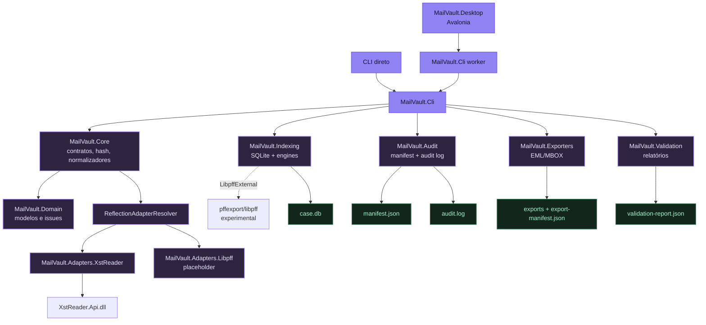
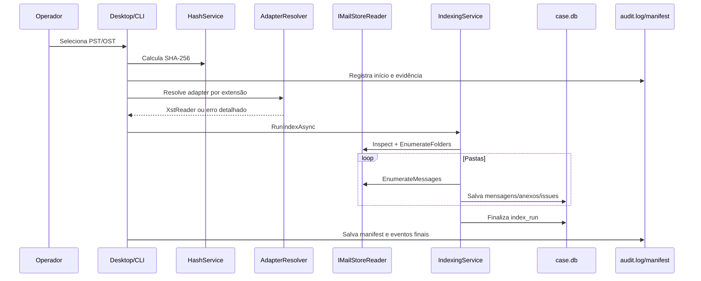

# Arquitetura Técnica

Este documento consolida a arquitetura real observada no código do MailVault Recovery. Ele não descreve features desejadas como se estivessem prontas.

## Visão geral

MailVault Recovery é uma solução .NET `net10.0` organizada em camadas:

- **Interfaces**: Desktop Avalonia e CLI.
- **Core/Domain**: contratos, modelos, normalização, hash e resolução dinâmica de adapters.
- **Processamento**: indexação SQLite, exportação EML/MBOX, validação de exportações.
- **Adapters**: leitor PST/OST via XstReader e placeholder Libpff.
- **Persistência local**: case folder com `case.db`, `manifest.json`, `audit.log` e artefatos de exportação.



## Projetos da solução

| Projeto | Papel real |
| --- | --- |
| `MailVault.Domain` | Records e tipos de domínio: mensagens, pastas, anexos, issues, manifest, audit event e metadados de store. |
| `MailVault.Core` | Interfaces, serviços de hash, normalizadores, contratos de índice/exportação e `ReflectionAdapterResolver`. |
| `MailVault.Audit` | Escrita de `audit.log` em JSON Lines e persistência de `manifest.json`. |
| `MailVault.Indexing` | Schema SQLite, leitura/escrita de `case.db`, serviço de indexação e engines `XstReader`/`LibpffExternal`. |
| `MailVault.Exporters.Eml` | Exportação de mensagens para EML usando MimeKit. |
| `MailVault.Exporters.Mbox` | Exportação MBOX com envelope `From ` e escape mboxrd. |
| `MailVault.Validation` | Validação de exportações EML/MBOX e geração de relatório JSON. |
| `MailVault.Adapters.XstReader` | Adapter funcional para `.pst`/`.ost` usando `XstReader.Api`. |
| `MailVault.Adapters.Libpff` | Projeto presente, mas ainda sem implementação de `IMailStoreReader`. |
| `MailVault.Cli` | Comandos públicos e workers internos usados pelo Desktop. |
| `MailVault.Desktop` | UI Avalonia, view models, serviços de workspace, worker orchestration, settings e Test Lab. |

## Boundaries importantes

### Core limpo

O Core define contratos como `IMailStoreReader`, `IAdapterResolver`, `ICaseIndexStore`, `ICaseIndexReader`, `IMessageExporter` e `IProgressReporter`. Bibliotecas de borda como Avalonia, MimeKit, SQLite e XstReader não devem vazar para modelos de domínio.

### Adapters dinâmicos

`ReflectionAdapterResolver` procura assemblies no `AppContext.BaseDirectory`:

| Adapter | Assembly esperado | Extensões | Prioridade | Estado |
| --- | --- | --- | --- | --- |
| XstReader | `MailVault.Adapters.XstReader.dll` | `.ost`, `.pst` | 10 | Funcional quando DLL e dependências estão no output. |
| Libpff | `MailVault.Adapters.Libpff.dll` | `.ost`, `.pst` | 5 | Placeholder; assembly existe, mas não há reader. |

Se nenhum adapter saudável for encontrado, o erro inclui extensão, pasta pesquisada, assemblies esperados e status dos adapters.

### Desktop e worker CLI

O Desktop não executa todo processamento pesado diretamente na UI. Para jobs longos, ele resolve o `MailVault.Cli` por `WorkerExecutableResolver` e chama `worker --job <arquivo-json>`. O arquivo de job fica temporariamente dentro do case folder e o worker emite eventos JSON em stdout.

Ordem de resolução do worker:

1. `MAILVAULT_CLI_PATH`, se apontar para caminho permitido.
2. Layout publicado ao lado do Desktop: `MailVault.Cli.exe` ou `MailVault.Cli.dll`.
3. Layout de desenvolvimento em `src/MailVault.Cli/bin/<Debug|Release>/net10.0`.
4. Fallback `dotnet run --project src/MailVault.Cli/MailVault.Cli.csproj --`.

O resolver evita usar outputs de `tests`, `scratch` ou corpus local, exceto com `MAILVAULT_ALLOW_TESTS_PATH=true`.

## Modelo de dados local

O case folder concentra os artefatos técnicos:

```text
<case-folder>/
├── case.db
├── manifest.json
├── audit.log
├── case.db-wal / case.db-shm
├── libpff-recovery/              # apenas se LibpffExternal for executado
├── libpff-diagnostic.log         # apenas se LibpffExternal for executado
└── native-tool-diagnostic-report.json
```

O schema SQLite atual é versão 3 e inclui tabelas como:

- `case_info`
- `index_runs`
- `folders`
- `messages`
- `attachments`
- `issues`

O store habilita `foreign_keys`, `busy_timeout`, `journal_mode=WAL` e `synchronous=FULL`.

## Pipeline de indexação



## Exportação

`ExportJobRunner` lê o `case.db`, valida `case_info`, exige que a evidência original ainda exista e recalcula o SHA-256 antes de exportar. Se o hash da evidência divergir do índice, a exportação é abortada.

Formatos implementados:

- **EML**: um arquivo por mensagem, com MimeKit.
- **MBOX**: arquivo por pasta, com escape de linhas internas `From `.

Também há suporte a `dry-run`, paginação, seleção por pasta, extração de anexos e `export-manifest.json`.

## Validação

`ValidationEngine` compara exportação física, manifest e índice. Ele detecta, entre outros:

- arquivos EML ausentes, vazios, duplicados ou inválidos;
- estrutura MBOX vazia, contagem divergente e linha `From ` não escapada;
- divergência de anexos;
- tentativa de path traversal;
- ausência de `export-manifest.json` quando esperado.

Relatórios evitam incluir corpo sensível de e-mail.

## Ferramentas externas

`XstReader.Api` é a dependência operacional de leitura PST/OST. `pffexport/libpff` existe como motor externo experimental: o código detecta e executa a ferramenta, mas ainda não transforma a saída em índice completo.

Detalhes em [EXTERNAL_TOOLS.md](EXTERNAL_TOOLS.md).

## Limitações arquiteturais atuais

| Limitação | Impacto |
| --- | --- |
| `MailVault.Adapters.Libpff` não implementa `IMailStoreReader` | Não há adapter libpff dinâmico funcional. |
| `LibpffExternal` não parseia saída do `pffexport` para mensagens | O fluxo é diagnóstico/fallback experimental, não recuperação completa. |
| Publish não inclui `pffexport.exe` | Plug and play com libpff ainda não está implementado. |
| Sem reader direto para MBOX/EML/MSG | Esses formatos são tratados em exportação, validação ou scan, não como ingestão completa. |
| Desktop depende do CLI para workers | Artefato publicado precisa manter Desktop e CLI lado a lado. |
