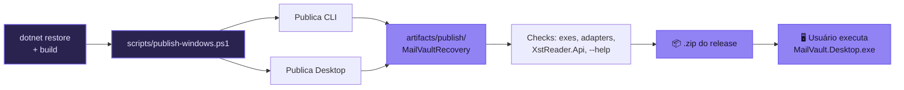

# 🛠️ Build e publicação

Este guia documenta apenas comandos e artefatos existentes no repositório, do código-fonte ao release que o usuário final executa.



## Pré-requisitos

- .NET SDK compatível com `net10.0`.
- PowerShell para usar `scripts/publish-windows.ps1`.
- Windows `win-x64` para o script de publish atual.
- Permissão de escrita em `artifacts/publish/MailVaultRecovery`.

## Comandos de desenvolvimento

| Objetivo | Comando |
| --- | --- |
| Restaurar | `dotnet restore MailVault.sln` |
| Build completo | `dotnet build MailVault.sln` |
| Testes | `dotnet test MailVault.sln` |
| Ajuda do CLI | `dotnet run --project src/MailVault.Cli/MailVault.Cli.csproj -- --help` |
| Desktop | `dotnet run --project src/MailVault.Desktop/MailVault.Desktop.csproj` |

## Publicação Windows

O script oficial atual publica CLI e Desktop na mesma pasta:

```powershell
.\scripts\publish-windows.ps1
```

Publicação self-contained:

```powershell
.\scripts\publish-windows.ps1 -SelfContained
```

Parâmetros aceitos pelo script:

| Parâmetro | Padrão | Uso |
| --- | --- | --- |
| `-Configuration` | `Release` | Configuração do `dotnet publish`. |
| `-Runtime` | `win-x64` | Runtime de destino. |
| `-SelfContained` | `false` | Quando presente, publica self-contained. |

## O que o script faz

1. Resolve a raiz do repositório.
2. Remove a pasta `artifacts/publish/MailVaultRecovery`, se existir.
3. Publica `src/MailVault.Cli/MailVault.Cli.csproj`.
4. Publica `src/MailVault.Desktop/MailVault.Desktop.csproj`.
5. Verifica arquivos essenciais:
   - `MailVault.Desktop.exe`
   - `MailVault.Cli.exe`
   - `MailVault.Adapters.XstReader.dll`
   - `XstReader.Api.dll`
6. Executa checks funcionais básicos:
   - `MailVault.Cli.exe --help`
   - `MailVault.Cli.exe index-worker --help`

## Layout publicado

O output esperado fica em:

```text
artifacts/publish/MailVaultRecovery/
├── MailVault.Desktop.exe
├── MailVault.Desktop.dll
├── MailVault.Cli.exe
├── MailVault.Cli.dll
├── MailVault.Adapters.XstReader.dll
├── MailVault.Adapters.Libpff.dll
├── XstReader.Api.dll
├── Microsoft.Data.Sqlite.dll
├── MimeKit.dll
├── Avalonia*.dll
└── demais dependências geradas pelo publish
```

`MailVault.Adapters.Libpff.dll` pode estar presente por referência de projeto, mas isso não significa que exista reader libpff funcional. O projeto ainda contém apenas placeholder.

## Executar o artefato publicado

Desktop:

```powershell
.\artifacts\publish\MailVaultRecovery\MailVault.Desktop.exe
```

CLI:

```powershell
.\artifacts\publish\MailVaultRecovery\MailVault.Cli.exe --help
```

Indexar um arquivo:

```powershell
.\artifacts\publish\MailVaultRecovery\MailVault.Cli.exe index "C:\evidencias\mailbox.pst" --out ".\mailvault-cases" --case-id "CASE-001"
```

## Plug and play: estado real

| Item | Estado no publish atual |
| --- | --- |
| Desktop + CLI lado a lado | Implementado. |
| Adapter XstReader | Validado pelo script. |
| `XstReader.Api.dll` | Validado pelo script. |
| Dependências .NET/Avalonia/MimeKit/SQLite | Geradas pelo `dotnet publish`. |
| `pffexport.exe` | Não copiado e não validado. |
| `readpst.exe` | Não copiado e não validado. |
| Licenças de ferramentas externas nativas | Não empacotadas no artefato. |

## Checklist de validação manual

Após publicar:

```powershell
Test-Path .\artifacts\publish\MailVaultRecovery\MailVault.Desktop.exe
Test-Path .\artifacts\publish\MailVaultRecovery\MailVault.Cli.exe
Test-Path .\artifacts\publish\MailVaultRecovery\MailVault.Adapters.XstReader.dll
Test-Path .\artifacts\publish\MailVaultRecovery\XstReader.Api.dll
.\artifacts\publish\MailVaultRecovery\MailVault.Cli.exe --help
```

Se o objetivo for validar `pffexport` experimental:

```powershell
Get-Command pffexport -ErrorAction SilentlyContinue
```

ou verifique se `pffexport.exe` está em um dos diretórios documentados em [EXTERNAL_TOOLS.md](EXTERNAL_TOOLS.md).

## Lacuna técnica recomendada

Para tornar o libpff plug and play de verdade, ainda é necessário:

1. Definir política de licença e redistribuição do libpff.
2. Adicionar binários nativos ao processo de publish.
3. Validar `pffexport.exe` no script.
4. Registrar versão/licença no artefato publicado.
5. Implementar parser da saída do `pffexport` para preencher `folders`, `messages`, `attachments` e `issues` no `case.db`.
6. Criar testes cobrindo ferramenta ausente, ferramenta presente, timeout, exit code não zero e layout publicado.

## 📦 Distribuição para o usuário final

O release publicado é **self-contained** (`-SelfContained`): embute o runtime .NET, então a máquina de destino **não precisa** ter o .NET instalado.

### Requisitos do sistema

| Componente | Requisito |
| :--- | :--- |
| Sistema operacional | Windows 10 ou superior (64-bit) |
| Arquitetura | x64 |
| Runtime .NET | Não necessário (build self-contained embute o runtime) |
| Visual C++ Redistributable | Pode ser necessário para o adapter nativo libpff (experimental) |
| Espaço em disco | ~120 MB Desktop · ~70 MB CLI (aproximado, self-contained) |

### Executar o release

1. Baixe e extraia o `.zip` do [release](https://github.com/borges-br/mailvault_recovery/releases).
2. **Desktop:** dê duplo clique em `MailVault.Desktop.exe`. O assistente guia: criar/abrir caso → escolher o `OST/PST` → indexar → navegar, buscar e exportar.
3. **CLI:** use `MailVault.Cli.exe` (ou `mailvault.exe`) na mesma pasta. Veja o [Manual do CLI](cli-commands.md).

> [!NOTE]
> O binário ainda **não é assinado** — o SmartScreen/Windows pode exibir um aviso na primeira execução. Assinatura de código é um próximo passo do roadmap.

### Script alternativo

Além do `scripts/publish-windows.ps1` (oficial, saída em `artifacts/publish/MailVaultRecovery`), existe um `publish.ps1` simples na raiz que publica Desktop e CLI separadamente em `dist/`. Para releases, prefira o script oficial, que valida adapters e roda checks funcionais.
