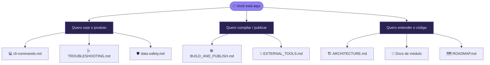

# 📖 Documentação — MailVault Recovery

Bem-vindo à documentação técnica do **MailVault Recovery**. Se você procura uma visão geral do produto, comece pelo [README principal](../README.md). Aqui está o detalhe de engenharia.

## 🚦 Comece por aqui

| Guia | Para quê |
| :--- | :--- |
| [💻 cli-commands.md](cli-commands.md) | Referência completa do CLI: comandos, opções e exemplos. |
| [🩺 TROUBLESHOOTING.md](TROUBLESHOOTING.md) | Diagnóstico rápido dos erros mais comuns. |
| [🛡️ data-safety.md](data-safety.md) | Trabalhar sobre cópias, hash de integridade e privacidade. |

## 📐 Guias canônicos

Revisados contra o código atual — esta é a referência principal.

| Documento | Conteúdo |
| :--- | :--- |
| [🏗️ ARCHITECTURE.md](ARCHITECTURE.md) | Camadas, boundaries, fluxo de indexação/exportação e limitações reais. |
| [🛠️ BUILD_AND_PUBLISH.md](BUILD_AND_PUBLISH.md) | Build, testes, publicação Windows e layout do release. |
| [🔌 EXTERNAL_TOOLS.md](EXTERNAL_TOOLS.md) | XstReader, `pffexport`/libpff (experimental) e `readpst`. |
| [🗺️ ROADMAP.md](ROADMAP.md) | O que está pronto, parcial e planejado. |

## 🧩 Referência técnica por módulo

| Documento | Tema |
| :--- | :--- |
| [adapter-resolver.md](adapter-resolver.md) | Resolução dinâmica de adapters de leitura. |
| [xstreader-adapter.md](xstreader-adapter.md) | Boundary e garantias do adapter XstReader. |
| [indexing.md](indexing.md) | Schema SQLite e estratégia de indexação por caso. |
| [exporting.md](exporting.md) | Pipeline de exportação (`case.db` → EML/MBOX). |
| [eml-exporter.md](eml-exporter.md) | Geração de arquivos EML com MimeKit. |
| [mbox-exporter.md](mbox-exporter.md) | Escrita MBOX e escape mboxrd. |
| [validation.md](validation.md) | Validação de integridade das exportações. |
| [normalization.md](normalization.md) | Normalização e sanitização de metadados. |
| [desktop-ui.md](desktop-ui.md) | Estrutura da interface Avalonia. |

## 🔗 Dependências e terceiros

| Documento | Tema |
| :--- | :--- |
| [dependency-policy.md](dependency-policy.md) | Política de dependências do projeto. |
| [third-party/xstreader.md](third-party/xstreader.md) | Atribuição e notas do XstReader. |

---

## 🧹 Regra de manutenção

Ao alterar comportamento do código, atualize na mesma mudança:

1. **[README principal](../README.md)** — se afetar onboarding, formatos, fluxo ou limitações.
2. O **guia canônico** correspondente nesta pasta.
3. O **[ROADMAP](ROADMAP.md)** — se uma feature mudar de _planejada/parcial_ para _pronta_.
4. O **[TROUBLESHOOTING](TROUBLESHOOTING.md)** — se mudar mensagens de erro ou diagnóstico.

> [!NOTE]
> Notas de processo, logs de milestone e experimentos de laboratório **não** ficam versionados aqui — eles vivem localmente em `notes/` (fora do GitHub). Esta pasta contém apenas documentação de referência.
