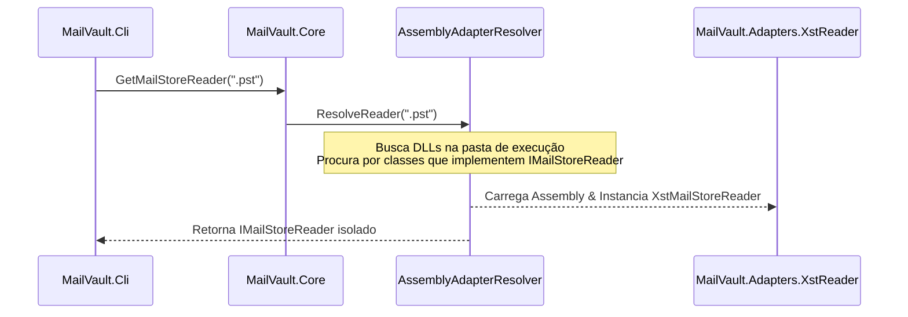

# MailVault Recovery — Carregamento Dinâmico de Adapters

Este documento detalha a arquitetura do resolvedor dinâmico de assemblies (`IAdapterResolver`), que isola os drivers proprietários ou nativos de leitura e extração (como o XstReader ou bibliotecas nativas de terceiros) das camadas puras do domínio e de aplicação do MailVault Recovery.

## O Desafio da Pureza Arquitetural

No design do MailVault Recovery, mantemos a diretriz de **Clean Core**:
- O domínio (`MailVault.Domain`) é 100% isolado de pacotes externos.
- O core (`MailVault.Core`) define os contratos de abstração e os pipelines de processamento sem referenciar tecnologias específicas.
- O executável da CLI (`MailVault.Cli`) referencia apenas o Domain, Core e Audit, mas **não** pode referenciar diretamente os adapters de arquivos `.ost/.pst` em tempo de compilação.

Para resolver e carregar dinamicamente os leitores de dados corretos de acordo com a extensão do arquivo inspecionado (como `.ost`/`.pst`), introduzimos a abstração de resolução de adaptadores.

---

## Estrutura do Adapter Resolver

O núcleo (`MailVault.Core`) define as seguintes peças para carregamento sob demanda:

### 1. `AdapterDescriptor`
Descreve as capacidades de um adaptador de leitura sem exigir sua instanciação:
```csharp
public sealed record AdapterDescriptor(
    string Name,
    string Description,
    IReadOnlyList<string> SupportedExtensions
);
```

### 2. `IAdapterResolver`
Contrato para busca e instanciação em tempo de execução dos leitores do correio:
```csharp
public interface IAdapterResolver
{
    IReadOnlyList<AdapterDescriptor> GetAvailableAdapters();
    OperationResult<IMailStoreReader> ResolveReader(string fileExtension);
}
```

---

## Fluxo de Carregamento em Tempo de Execução

Ao receber uma requisição de indexação ou inspeção na CLI, o fluxo de instanciação ocorre dinamicamente:



### Mecanismo de Carregamento
O carregador dinâmico de assemblies busca DLLs que seguem o padrão `MailVault.Adapters.*.dll` no diretório de execução:
1. Carrega o Assembly correspondente via reflection.
2. Inspeciona o Assembly procurando por tipos que implementem `IMailStoreReader` e que suportem a extensão solicitada.
3. Instancia e injeta o objeto correspondente sem que a CLI ou o Domain saibam que a dependência do `XstReader` existe.

---

## Vantagens Técnicas e Escalabilidade

1. **Testabilidade Absoluta**: Nos testes de unidade e testes integrados de CLI, injetamos dinamicamente um `FakeMailStoreReader.cs` no Program, permitindo exercitar o pipeline da CLI sem precisar carregar arquivos PST reais ou usar componentes de terceiros instáveis.
2. **Modularidade**: Podemos facilmente escrever um adaptador nativo com `Libpff` ou para o formato `.eml` no futuro apenas depositando uma nova DLL na pasta de binários, sem necessidade de recompilar a CLI ou alterar o Core.
3. **Gerenciamento de Vulnerabilidades**: O isolamento em projetos separados impede que vulnerabilidades transitivas de leitores de arquivo de terceiros afetem a conformidade técnica global dos outros módulos do produto.
