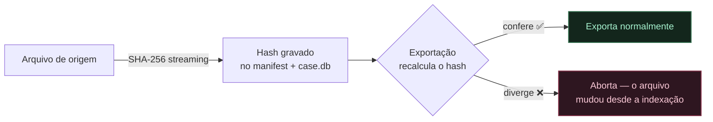

# 🛡️ Segurança e integridade de dados

Recuperar e-mails é mexer com dados sensíveis e, muitas vezes, com **arquivos já fragilizados**. Este guia reúne práticas simples que protegem tanto a fonte quanto o resultado da recuperação.

> [!IMPORTANT]
> **Regra de ouro: nunca trabalhe sobre o único arquivo original.** Faça uma cópia e recupere a partir dela. Se algo der errado, o original continua intacto.

## ✅ As 5 práticas essenciais

| # | Prática | Por quê |
| :---: | :--- | :--- |
| 1 | **Trabalhe sobre uma cópia** | Preserva o arquivo original caso uma tentativa de leitura agrave um dano. |
| 2 | **Guarde o hash SHA-256** | O MailVault calcula o SHA-256 da fonte; guarde-o para detectar se o arquivo mudou entre uma sessão e outra. |
| 3 | **Use disco local** | Evite pastas sincronizadas por nuvem (OneDrive/Dropbox) durante a indexação e exportação — elas bloqueiam e movem arquivos no meio do processo. |
| 4 | **Não sobrescreva os artefatos** | `case.db`, `manifest.json`, `audit.log`, exports e relatórios contam a história do que foi recuperado. |
| 5 | **Trate o resultado como sensível** | Exports `EML`/`MBOX` contêm o conteúdo integral das mensagens e anexos. Proteja a pasta de destino. |

## 🔐 Privacidade: tudo é local

O MailVault Recovery **não tem servidor e não envia nada para lugar nenhum**. Todo o processamento acontece na sua máquina:

- não há upload de arquivos, mensagens ou metadados;
- não há telemetria nem coleta de uso;
- o índice `case.db` e os exports ficam apenas onde você mandar gravar.

A responsabilidade pela proteção desses arquivos (permissões de pasta, backup, descarte) é de quem opera.

## #️⃣ Hash de integridade

O hash SHA-256 é calculado por streaming na inspeção/indexação e gravado no índice e no `manifest.json`.

Isso garante que você está exportando a partir **exatamente** do mesmo arquivo que foi indexado. Se o original for movido, substituído ou alterado, a exportação para e avisa.

## ⚠️ O que o MailVault não promete

- **Recuperação garantida.** Arquivos podem estar parcial ou totalmente danificados. A ferramenta recupera o que for possível e relata o resto — não inventa dados.
- **Reparo do arquivo de origem.** O `OST/PST` é tratado como somente-leitura; o MailVault extrai dele, não o conserta.

## ⚖️ Uso em contexto formal

O MailVault Recovery preserva hash, manifesto e trilha de eventos (`audit.log`), o que **apoia** processos que exigem rastreabilidade. Ainda assim, ele é uma ferramenta de recuperação técnica — não um laudo pericial. Quando o resultado for usado em disputa judicial ou auditoria regulatória, a metodologia, a cadeia de custódia e a assinatura técnica continuam sendo responsabilidade do operador e da organização.

## 📌 Fluxo recomendado, em uma linha

> Copie o arquivo → recupere a partir da cópia → guarde hash, `manifest.json` e relatórios → proteja a pasta de exports.
