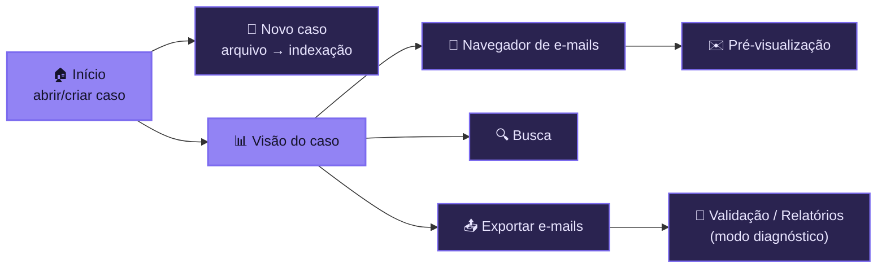

# 🖥️ Interface Desktop

Este documento descreve a arquitetura e as telas do aplicativo desktop do **MailVault Recovery**, construído em Avalonia.

## 1. Arquitetura e stack

O módulo visual fica em `src/MailVault.Desktop/` e segue:

- **Framework UI:** **Avalonia UI 11**, compatível com .NET 10.
- **Padrão:** **MVVM** reativo, com bindings nativos do Avalonia.
- **Temas:** **Dark e Light**, derivados da paleta da marca (violeta). A troca é feita em Configurações e aplicada em runtime.
- **Clean Core (isolamento):** a camada desktop **não** referencia diretamente SQLite, `XstReader` ou `MimeKit`. Todo acesso a dados passa pelos contratos abstratos do Core/Domain (ex.: `ICaseIndexReader`).
- **Worker isolado:** jobs pesados (indexação, exportação, validação) rodam no `MailVault.Cli` como subprocesso, mantendo a interface fluida. Veja [ARCHITECTURE.md](ARCHITECTURE.md).

## 2. Mapa de telas



### 🏠 Início
Abrir um caso existente (pasta com `case.db`) ou iniciar um novo. Validação rápida do `case.db` antes de carregar.

### 🧙 Assistente de novo caso
Guia o usuário: escolher o arquivo `OST/PST` → confirmação e privacidade → indexação. Durante a indexação mostra **timer, throughput (e-mails/s) e ETA**.

### 📊 Visão do caso
Metadados do caso (ID, adapter usado, caminhos), inventário consolidado (pastas, mensagens, anexos, issues) e o hash SHA-256 da origem.

### 📨 Navegador de e-mails
Layout de 3 painéis no estilo cliente de e-mail:

| Painel | Conteúdo |
| :--- | :--- |
| Esquerdo | Árvore de pastas indexadas. |
| Central | Lista paginada de mensagens (assunto, remetente, data, badges de anexo `📎` e de problema). |
| Direito | Pré-visualização da mensagem. |

### ✉️ Pré-visualização
Mostra metadados (assunto, remetentes, destinatários, datas, anexos) e o conteúdo da mensagem. O corpo completo das mensagens **não** é mantido no índice — é lido sob demanda a partir do arquivo de origem.

### 🔍 Busca
Busca rápida sobre os metadados indexados, com resultados ligados ao mesmo visualizador.

### 📤 Exportar e-mails
Configura formato (`EML`/`MBOX`), extração de anexos e acompanha o job: mensagens exportadas, falhas, anexos, timer e cancelamento. Ao final, abre o relatório da exportação.

## 3. Indicador global de indexação

Enquanto uma indexação está em andamento, uma **pílula clicável na barra superior** mostra o progresso em **qualquer tela**. Clicar volta ao assistente sem reiniciar o job. Estados terminais (concluído / cancelado / falhou) viram um aviso clicável.

## 4. Modo diagnóstico

Telas avançadas — **Validação**, **Relatórios do caso** e **Test Lab** — ficam ocultas por padrão e aparecem ao ativar o **modo diagnóstico** em Configurações. O fluxo principal do produto permanece enxuto para o usuário comum.

## 5. Executar em desenvolvimento

```powershell
dotnet run --project src/MailVault.Desktop/MailVault.Desktop.csproj
```
