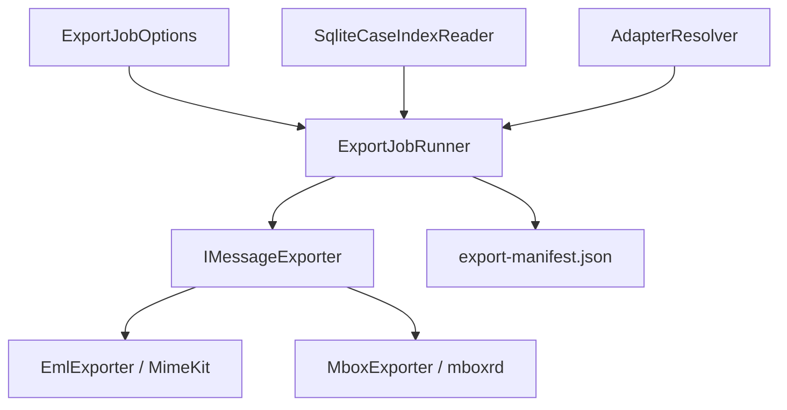

# Engine de Exportação

Esta documentação descreve o funcionamento, a arquitetura e os mecanismos de segurança da Engine de Exportação (`ExportJobRunner`) do MailVault Recovery.

## 1. Visão Geral

O motor de exportação reside na camada `MailVault.Core` e é responsável por ler metadados do banco SQLite relacional (`case.db`), validar a integridade física do arquivo de origem contendo a evidência e orquestrar a exportação em lote de pastas e mensagens para formatos abertos de preservação (EML ou MBOX), mantendo a integridade verificável por hash e prevenindo gravação fora do diretório de destino.

---

## 2. Princípios de Arquitetura e Clean Core

1. **Isolação de Bibliotecas Externas**:
   - `MimeKit` é restrito a `MailVault.Exporters.Eml`.
   - `Microsoft.Data.Sqlite` é restrito a `MailVault.Indexing`.
   - O núcleo (`MailVault.Core`) não referencia nenhuma dessas dependências diretamente, operando estritamente através das abstrações `IMessageExporter`, `IAttachmentContentProvider` e `ICaseIndexReader`.
2. **Desacoplamento de Adapters**:
   - A leitura física é resolvida dinamicamente através do `IAdapterResolver`. Os motores de exportação nunca dependem diretamente do `XstReader` ou `Libpff`.

---

## 3. Fluxo de execução

1. **Verificação de Integridade Física (Gate 2)**:
   - Antes de iniciar a gravação física de qualquer arquivo, o runner calcula o hash SHA-256 da mídia original (`.pst`/`.ost`) e o compara com o hash registrado no início do caso.
   - Qualquer discrepância aborta imediatamente a exportação, garantindo a preservação da cadeia de custódia.
2. **Aplanamento da Hierarquia de Pastas**:
   - O runner recupera a árvore de pastas e a aplana recursivamente para suportar seleções de pastas em qualquer nível hierárquico (como `Inbox/Subfolder`) e calcular com precisão a contagem total de itens.
3. **Paginação e Filtros**:
   - Suporta a aplicação de filtros de pasta, limites de paginação (`--limit`) e offsets (`--offset`) aplicados de forma global na seleção combinada de e-mails para evitar sobrecarga.
4. **Streaming de Anexos Eficiente (Gate 4)**:
   - Para evitar o estouro de memória RAM com anexos volumosos, o runner utiliza a interface `IAttachmentContentProvider` que expõe streams binários sob demanda (`OpenAttachmentStreamAsync`), transmitindo bytes diretamente da mídia física original ao arquivo final no disco em blocos otimizados.

---

## 4. Segurança Física e Proteção de Dados

### Prevenção de Path Traversal
Durante a gravação de arquivos EML ou anexos avulsos, o MailVault Recovery aplica barreiras rígidas para evitar que nomes maliciosos gravem arquivos fora do diretório de destino homologado (`baseOutputDir`).

1. **Sanitização de Nomes (`SanitiseFilename`)**:
   - Remove ou substitui blocos de escape relativos (`../`, `..\`, `..`) por sublinhados (`_`) antes de avaliar outros caracteres.
   - Filtra caracteres inválidos definidos pelo sistema operacional (`Path.GetInvalidFileNameChars()`).
   - Mantém consistência com o `AttachmentNameNormalizer`.
2. **Validação de Caminho Físico (`EnsureSafeWritePath`)**:
   - Resolve o caminho canônico (`Path.GetFullPath()`) do arquivo de destino e do diretório base.
   - Valida se o caminho de destino inicia rigorosamente com o diretório base. Lança `UnauthorizedAccessException` em caso de tentativa de violação.

### Minimização de Dados (Gate 10)
- Nenhuma informação privada ou corpos completos de e-mail são salvos no manifesto forense `export-manifest.json` ou no banco `case.db`. O manifesto relata contagens numéricas, caminhos físicos relativos dos arquivos gerados, hashes, logs de auditoria e problemas estruturais.
