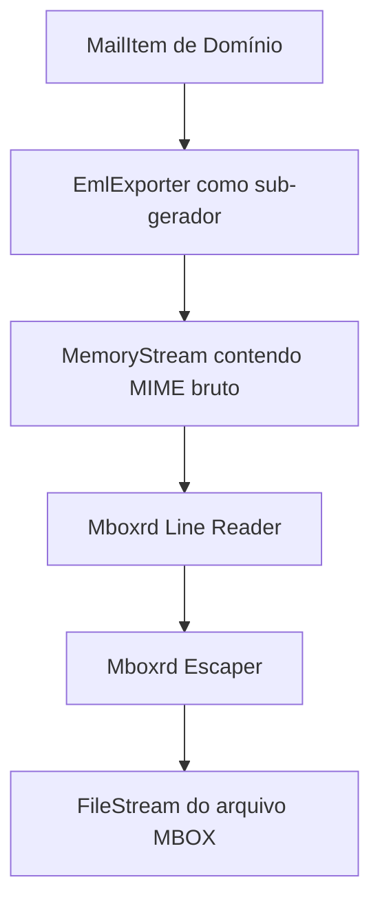

# Gerador de Arquivos MBOX (MboxExporter)

Esta documentação descreve o funcionamento técnico do gerador MBOX (`MboxExporter`) e o mecanismo de escaping mboxrd do MailVault Recovery.

## 1. Visão Geral

O projeto `MailVault.Exporters.Mbox` é responsável pela geração do formato **MBOX**, uma estrutura de arquivo único sequencial que concatena múltiplas mensagens de e-mail separadas por uma linha delimitadora (envelope) iniciada pela palavra chave `From `.

---

## 2. Princípios de Isolação Tecnológica

- O projeto `MailVault.Exporters.Mbox` **não** adiciona nenhuma dependência externa, incluindo o `MimeKit` ou o `Microsoft.Data.Sqlite`.
- Para evitar reescrever o gerador MIME e manter a conformidade com as regras de isolação, o `MboxExporter` utiliza injeção de dependência do `IMessageExporter` (que é resolvida dinamicamente em tempo de execução para o `EmlExporter`), permitindo gerar a representação RFC 822 bruta na memória antes de gravá-la e tratá-la sequencialmente.

---

## 3. Arquitetura de Gravação Incremental

Arquivos MBOX podem crescer até centenas de gigabytes. O `MboxExporter` adota um padrão de gravação incremental rígido por pasta, processando e liberando buffers sequencialmente para garantir estabilidade operacional.



---

## 4. O Mecanismo mboxrd escaping

Diferente de formatos legados como o mboxo, o padrão **mboxrd** é o mais robusto e forense porque impede a corrupção de mensagens cujo conteúdo real comece com a palavra `From `. Ele adiciona um caractere de escape maior que (`>`) à frente de qualquer linha do corpo da mensagem que corresponda à expressão regular de envelope `From ` ou que já comece com uma sequência arbitrária de caracteres maior que seguidos de `From ` (ex: `>From `, `>>From `, etc.).

### Implementação do Escaper
Para cada mensagem a ser adicionada ao MBOX, o exportador:
1. Grava a linha envelope MBOX técnica:
   `From <sender@email.local> <timestamp_em_formato_asctime>`
   *Exemplo:* `From sender@fake.local Tue May 26 15:30:00 2026`
2. Lê a mensagem MIME gerada linha a linha.
3. Para cada linha de conteúdo lida:
   - Se a linha começar com a palavra `From ` (com ou sem caracteres de escape leading `>`), o escaper adiciona mais um caractere `>` à frente:
     ```csharp
     // Se a linha coincide com o padrão mboxrd: ^(>*From )
     if (StartsWithFromPattern(line))
     {
         line = ">" + line;
     }
     ```
   - Grava a linha modificada no arquivo MBOX.
4. Adiciona uma linha em branco obrigatória (`\n`) no final de cada mensagem para servir de espaçador técnico.

Isso garante a reversibilidade forense perfeita: durante uma posterior importação ou leitura, a remoção do primeiro `>` de qualquer linha correspondente ao padrão reconstrói exatamente o corpo original sem perdas de bits.
