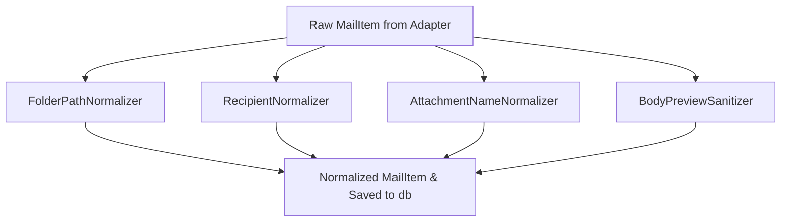

# Pipeline de Normalização

Este documento descreve as políticas de normalização de dados forenses, sanitização técnica e privacidade implementadas no núcleo (`MailVault.Core`) do produto.

## Princípios de Normalização e Conformidade

A coleta forense offline requer a tradução de formatos e estruturas de e-mails proprietários (como as propriedades MAPI no Microsoft Outlook) em dados limpos, consistentes e que respeitem as leis de proteção de dados (como GDPR/LGPD).

O MailVault Recovery adota a premissa de **Minimização de Dados**:
1. **Sem Persistência de E-mails Completos**: Corpos e cabeçalhos brutos completos **não** são indexados ou gravados permanentemente no banco `case.db` para evitar violações massivas de dados em caso de vazamento da pasta do caso.
2. **Sanitização de Caminhos de Usuário**: Detalhes técnicos de issues não expõem nomes de diretórios pessoais ou logs privados da máquina operadora.
3. **Timezone Fallback**: Datas forenses mantêm o offset UTC original da mensagem para preservar a integridade temporal em relatórios legais.

---

## Componentes do Pipeline de Normalização

O pipeline executa sob o serviço unificado `MailItemNormalizer` da camada `MailVault.Core.Normalization`.

### 1. FolderPathNormalizer
No Outlook, as pastas internas costumam ter separadores duplicados, invertidos e delimitadores incertos (por exemplo, `\\Top of Personal Folders\\Inbox\\\\Financeiro\\\\`).
* **Regra**: Remove delimitadores marginais e reduz barras invertidas em barras normais simples, normalizando os caminhos em padrão UNIX `/`.
* **Resultado**: `Top of Personal Folders/Inbox/Financeiro`

### 2. RecipientNormalizer
Os destinatários e remetentes extraídos dos arquivos `.ost/.pst` vêm poluídos com identificadores corporativos internos ou aspas desnecessárias.
* **Regra**: Limpa e isola o nome de exibição (`Display Name`) e o endereço SMTP de e-mail puro.
* **Resultado**: `Remetente <sender@domain.com>`

### 3. AttachmentNameNormalizer
Os arquivos anexados às mensagens podem conter caracteres inválidos para sistemas de arquivos locais modernos, impedindo futuras exportações seguras.
* **Regra**: Caracteres problemáticos em sistemas de arquivos (como `/`, `\`, `:`, `*`, `?`, `|`) são higienizados e substituídos por sublinhados (`_`), garantindo nomes estáveis e seguros de se gravar em disco.
* **Resultado**: `anexo:teste*financeiro.pdf` torna-se `anexo_teste_financeiro.pdf`.

### 4. BodyPreviewSanitizer
Garante que a CLI exiba informações suficientes de preview sem armazenar arquivos imensos ou dados completos de e-mails em um formato relacional plano.
* **Regra**: Limita rigorosamente o preview de texto a no máximo **30 linhas** e trunca linhas excessivamente largas (máximo de 200 caracteres por linha).
* **Truncamento de preview**: Se o texto exceder 30 linhas, o preview é interrompido e um aviso explícito de truncamento é injetado:
  `[... PREVIEW TRUNCADO - X LINHAS OCULTAS ...]`

---

## Sanitização de Dados Técnicos (Issues)

As falhas de extração registradas no banco de dados (`issues.technical_details`) sofrem higienização estrita antes da gravação em disco no construtor `SqliteCaseIndexWriter.SaveIssueAsync`:
* **Caminhos de Usuário**: Substitui referências dinâmicas a pastas privadas locais do Windows (`C:\Users\nomedousuario\...`) por uma tag genérica inofensiva `C:\Users\<USER>\...`.
* **Vazamentos de E-mail**: Expressões regulares detectam e filtram endereços de e-mail no log técnico substituindo-os por `<email_masked>`.
* **MAPI dumps**: Dumps de propriedades internas MAPI que excedam 200 caracteres são resumidos e rotulados como `[MAPI Dump Sanitized] ...`.
* **Truncamento Físico**: Limita estritamente o tamanho total desse campo a no máximo 500 caracteres.
