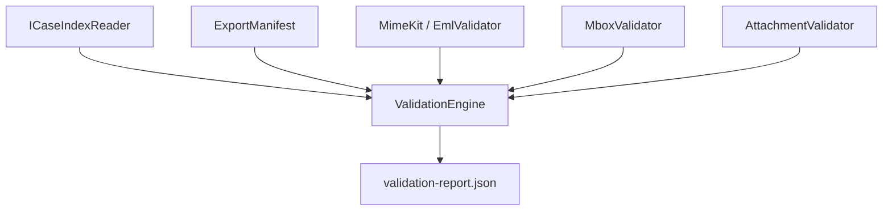

# Engine de Validação e Qualidade Forense (Recovery Quality)

Este documento descreve as especificações técnicas, a arquitetura e as regras operacionais da Engine de Validação (`ValidationEngine`) do MailVault Recovery.

---

## 1. Visão Geral

A engine de validação é projetada para auditar a qualidade técnica da indexação e da exportação, comparando de forma cruzada as informações registradas no banco de dados SQLite (`case.db`), no manifesto de exportação (`export-manifest.json`) e os arquivos físicos realmente gravados em disco.



---

## 2. Parâmetros e Comportamento da CLI

O comando principal é:
```bash
mailvault validate <case-folder> [options]
```

### Opções Disponíveis:
- `--export-folder <directory>`: Pasta física contendo os e-mails exportados. Se omitida, a engine tenta ler o caminho registrado no manifesto ou localiza a pasta `exports/` dentro do caso.
- `--format <eml|mbox|auto>` (padrão `auto`): O formato de exportação a ser auditado. `auto` resolve a partir do manifesto.
- `--json`: Se ativado, suprime a saída bonita e imprime diretamente o JSON do relatório.
- `--strict`: Ativa o modo estrito de validação.
- `--check-eml-parse <true|false>` (padrão `true`): Habilita o parseamento profundo de arquivos EML gerados usando a biblioteca MimeKit.
- `--check-mbox-structure <true|false>` (padrão `true`): Habilita a checagem estrutural dos arquivos MBOX e escape mboxrd.
- `--check-attachments <true|false>` (padrão `true`): Habilita a validação física e cruzada de arquivos de anexo.
- `--sample-size <number>`: Permite limitar a amostragem física de validação em grandes volumes (ex: verificar apenas 100 arquivos para ganhar velocidade).
- `--out <directory>`: Caminho de saída para gravação do relatório `validation-report.json`.

---

## 3. Regras de Validação Estrutural

### 3.1. Validação EML (MimeKit v4.16.0)
- Tenta instanciar e ler cada arquivo `.eml` gerado.
- Verifica se a mensagem possui ao menos um identificador básico (Subject, Message-ID ou data/remetente válidos).
- Garante que o arquivo físico possui tamanho > 0 bytes.
- Compara a quantidade de partes de anexo (`MimeMessage.Attachments`) com o número indexado correspondente no banco.
- **Minimização**: O texto completo do corpo nunca é armazenado no relatório de validação.

### 3.2. Validação MBOX (mboxrd envelope)
- Valida se o arquivo MBOX de destino por pasta existe e não está vazio caso haja mensagens indexadas.
- Varre o arquivo sequencialmente para contar o número de delimitadores `"From "`.
- **Validação de Escape mboxrd**: Identifica se existem linhas no corpo da mensagem iniciadas com a palavra chave `"From "` de forma sem escape (isto é, que não comecem com `>From ` ou `>>From `), o que causaria quebra estrutural e corrupção forense de caixas de correio.
- Compara a contagem aproximada de delimitadores com a quantidade reportada no manifesto e no SQLite.

### 3.3. Validação de Anexos
- Compara a quantidade total de anexos indexados no SQLite (`attachments`) com os anexos mapeados na exportação.
- Se os anexos foram extraídos fisicamente para arquivos avulsos, valida sua presença física no disco na pasta correspondente.
- Valida se os nomes estão de acordo com a política do normalizador.
- **Path Traversal Active Check**: Valida rigorosamente se o caminho completo absoluto de gravação de qualquer arquivo de anexo reside dentro do diretório homologado, impedindo violações de segurança ativa.

---

## 4. O Mecanismo `--strict` e Status do Relatório

O resultado da validação é sumarizado na propriedade `status` do relatório técnico final, assumindo os valores:
- **Passed**: Sucesso absoluto. Zero erros e zero warnings estruturais detectados.
- **PassedWithWarnings**: Sucesso com ressalvas. Warnings foram gerados (ex: arquivos MBOX vazios inesperados ou contagens levemente divergentes), mas a integridade estrutural básica está preservada. *Disparado apenas se a flag `--strict` estiver desativada.*
- **Failed**: Falha de integridade técnica. Disparada em caso de erros fatais (ex: arquivos EML vazios, mensagens faltantes, violação de Path Traversal) ou se houve qualquer aviso técnico contendo divergência estrutural com a flag `--strict` ativada.
