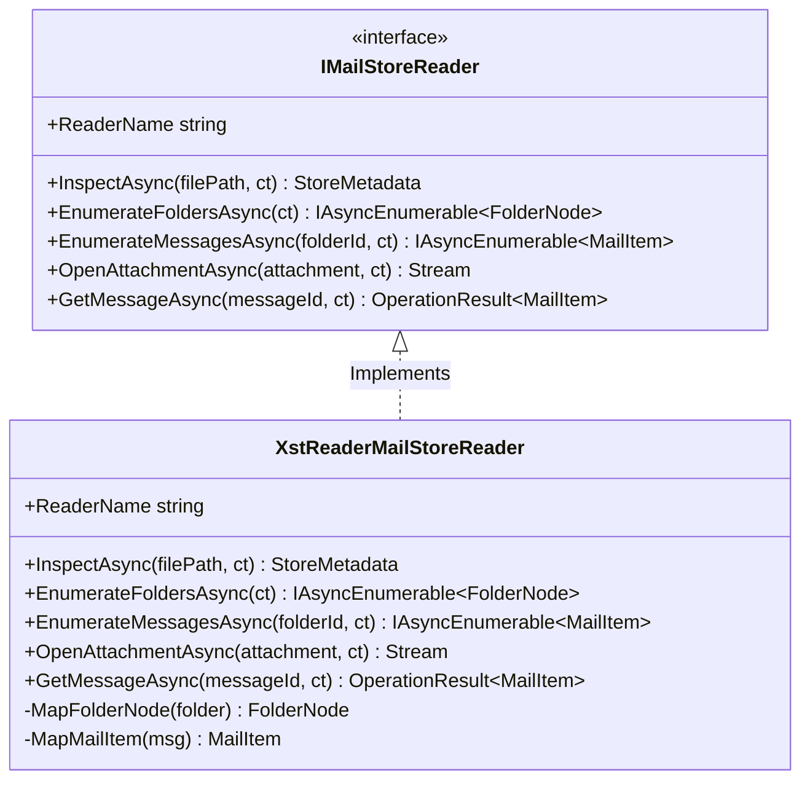

# Adapter Boundary — MailVault.Adapters.XstReader

Este documento detalha o design técnico, a implementação e as garantias arquiteturais do adapter **MailVault.Adapters.XstReader**, integrado na Milestone 2.

---

## Objetivos e Diretrizes Forenses

A integração do motor **XstReader.Api** (v1.0.6) obedece aos seguintes princípios rigorosos:

1. **Preservação de Evidências (Read-Only)**: O arquivo original OST/PST é tratado como evidência forense intocável. O adapter abre o arquivo estritamente em modo de leitura compartilhada (`FileAccess.Read`, `FileShare.ReadWrite` ou `FileShare.Read`) para evitar qualquer bloqueio exclusivo ou modificação acidental de metadados no sistema de arquivos.
2. **Clean Core (Isolamento Absoluto)**: Nenhum tipo, classe, interface ou exceção da biblioteca `XstReader` pode vazar para os contratos públicos de outros projetos. A dependência de compilação da biblioteca de terceiros está confinada exclusivamente neste projeto adapter.
3. **Pluggable Adapter (Runtime Loading)**: O projeto CLI (`MailVault.Cli`) e os núcleos de negócio não referenciam o adapter em tempo de compilação. Em tempo de execução, o assembly `MailVault.Adapters.XstReader.dll` é carregado dinamicamente via reflexão por meio do `AssemblyLoadContext`, fornecendo alta resiliência, modularidade e desacoplamento.

---

## Arquitetura do Adapter

O adapter implementa a interface `IMailStoreReader` definida em `MailVault.Core`:

### Mapeamento Seguro com Result Pattern

Para evitar exceções catastróficas em tempo de execução quando o leitor encontra blocos de dados ou propriedades corrompidas MAPI, o método `GetMessageAsync` utiliza o **Result Pattern** (`OperationResult<T>`) contido em `MailVault.Core`:

- Em caso de leitura de mensagem com avisos parciais, o item é retornado com sucesso contendo uma lista de `ExtractionIssue` anexada ao `MailItem`.
- Em caso de falha de decodificação crítica de uma mensagem individual, o adapter retorna `OperationResult.Failure` contendo os detalhes técnicos da falha, impedindo que um erro local crash a aplicação ou interrompa um processo de varredura/inspeção CLI em lote.

---

## Mitigação de Vulnerabilidades Transitivas (NU1903)

O pacote `XstReader.Api` (v1.0.6) possui uma dependência transitiva do pacote vulnerável `System.Security.Cryptography.Pkcs` na versão `6.0.1`.

Para mitigar a vulnerabilidade com segurança e sem introduzir dependências desnecessárias nas demais camadas do sistema:
- Adicionou-se uma **referência direta** de pacote para a versão estável mais atual `System.Security.Cryptography.Pkcs` (v9.0.0) **exclusivamente** no arquivo `MailVault.Adapters.XstReader.csproj`.
- Isto forçou o compilador e gerenciador de pacotes NuGet a atualizar a dependência transitiva durante a restauração do projeto, garantindo 100% de conformidade com segurança do ecossistema e eliminando avisos do compilador (`dotnet list package --vulnerable --include-transitive` limpo).
